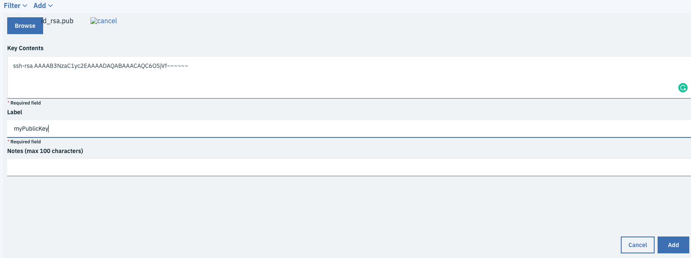
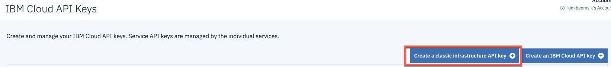
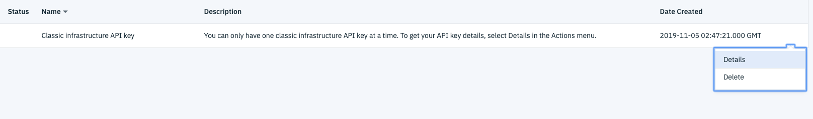

# How to deploy a Linux vm on ibmcloud with terraform 

## Prerequisite

### 1.Install terraform CLI (MacOS)
* Create terraform directory under Home directory

```bash
mkdir terraform
```

* Download Terraform CLI 0.11.14 version
https://releases.hashicorp.com/terraform/0.11.14/

```
Click terraform_0.11.14_darwin_amd64.zip 
```

* Move downloaded zip file from download folder to terraform folder and unzip
```bash
cd ~/Downloads/
mv terraform_0.11.14_darwin_amd64.zip ~/terraform/
unzip terraform_0.11.14_darwin_amd64.zip
```

* Change bash.profile file
```bash
vi ~/.bash_profile
Add 'export PATH=$PATH:$HOME/terraform' in .bash_profile
source ~/.bash_profile
```
  

### 2. Install IBM Cloud Provider Terraform plug-in
* Go to https://github.com/IBM-Cloud/terraform-provider-ibm/releases/tag/is-v1.0.0
* Click IBM Cloud Provider v1.0.0 for Terraform 0.12.x 
* Click `darwin_amd64.zip` from Assets 
* Unzip 
```bash
cd ~/Downloads/ && unzip darwin_amd64.zip
```
* Create a hidden folder for the plug-in
```bash
mkdir ~/.terraform.d/plugins
```
* Move downloaded zip file from download folder to hidden folder and unzip
```bash
mv terraform-provider-ibm ~/.terraform.d/plugins/
```
* Verify installation is complete
```bash
cd ~/.terraform.d/plugins/
./terraform-provider-ibm 
```
  Output

```
2019/11/05 09:43:08 IBM Cloud Provider version 0.18.0  
This binary is a plugin. These are not meant to be executed directly.  
Please execute the program that consumes these plugins, which will  
load any plugins automatically  
```

### 3. Generate and Upload SSH key to IBM Cloud 
* Generate a new SSH Key
```bash
ssh-keygen -t rsa
```
* Go to IBM Cloud Classic infra console

    https://cloud.ibm.com/classic/devices

* Go to SSH Keys section
```
Devices > Manage > SSH Keys
```
* Add your public keys
```
Add > Browse > navigate to .ssh folder(under HOME directory, click `shift + command + .`)  
> id_res.pub file > enter Label (`remember the Label!! this will be used in main.tf`)  
> Click Add Button
```



### 4. Create classic infra API Key
* Go to Manage > Access(IAM)

    https://cloud.ibm.com/iam/apikeys

* Create a classic infrastructure API key


## Terraform Code

### 1. Clone this repository to your local computer
```
git clone https://github.com/Tue8F/terraform_ibmcloud_vm.git
```
### 2. Change credentials.tf
Go to IBM Cloud API keys > click Details of Classic infrastructure API key  


Copy API user name value and paste it to "ibm_sl_username"
Copy API key value and paste it to "ibm_bmx_api_key" and "ibm_sl_api_key" 


### 3. Change main.tf
```
Change values of `ibm_compute_ssh_key` label as your label in IBM Cloud SSH Keys (https://cloud.ibm.com/classic/devices/sshkeys)
Change values of `hostname` and `domain` as your value
```

### 4. Apply terraform Code

```bash
terraform init
```

```bash
terraform plan
```

```bash
terraform apply
```

### 5. Check the result of terraform apply
* Go to classic Infrastructure
```
https://cloud.ibm.com/classic/devices
```
You can find device name in the Device list 


### Reference
* https://blog.kylekr.com/ibm-cloud-terraform-and-ansible
* https://cloud.ibm.com/docs/terraform?topic=terraform-manage_resources
* https://ibm-cloud.github.io/tf-ibm-docs/index.html
* https://cloud.ibm.com/docs/terraform?topic=terraform-setup_cli#setup_cli

#### End of Document


 


